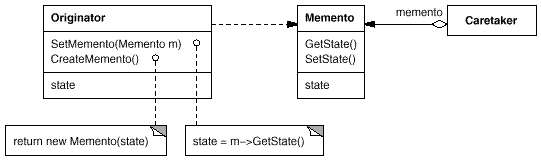

# Memento pattern

---

### Цел
Шаблонът "Мементо" описва как бихме могли да запазим вътрешното състояние на един обект, и как по-късно да го върнем в това състояние, без да нарушаваме капсулирането на обекта.

---

### Приложения

Използваме шаблонът "Мементо" когато:

* искаме да запазим вътрешното състояние на обект (или част от него) така, че по-късно да можем да приведем обекта обратно до съхраненото състояние 

* не искаме на разкриваме детайли от вътрешното състояние на обекта само с цел съхраняването му (с други думи не искаме да нарушаваме капсулирането му).

---

### Оценка

Шаблонът "Мементо" има следните предимства и недостатъци: 

1.	Запазване на капсулирането на обекта (Създателя) е основната причина да ползваме шаблона "Мементо" (Memento). Промени във вътрешната имплементация на Създателя евентуално биха довели само до промени в Мементо (който в общият случай е сравнително прост клас), но не и до такива в Пазителя, или в останалите части на системата.

2.	Създателят се опростява като клас, тъй като логиката по управлението на съхранението на състоянието (т.е. на обектите Мементо) се отделя в друг клас – Пазителя. В допълнение, по този начин изолираме механизма за запаметяване/възстановяване на състоянието от промени в имплементацията на Създателя.

3.	В зависимост от размера на обектите от тип Мементо и стратегията за съхраняването им, използването на шаблона може да доведе до заемане на голямо количество памет, което е потенциален проблем – особено ако за съхранение се използва RAM паметта.

4.	Ако за създаването на Мементо са необходими голям брой входно-изходни операции и/или процесорно време, това би могло да доведе до проблеми с производителността.

5.	Дефинирането (в Мементо) на втори интерфейс, достъпен само за определен клас (Създателя), може да е трудно и дори невъзможно в някои езици за програмиране.

