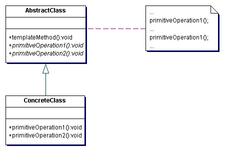

# Template method pattern

---

### Цел
"Шаблонният метод" позволява разделянето на имплементацията на алгоритъм на 2 нива. Логиката на алгоритъма е реализирана в базов родителски клас. Поведението на обектите в стъпките, специфични за конкретните наследници, е отложено за имплементация в самите тях.

---

### Приложения

Най-често Шаблонен метод се използва, когато:

* Имаме сложен логически алгоритъм. Логично следва да зададем стъпките на алгоритъма в родител¬ския клас и оставим на наследниците да реализират поведението на стъпките, които са конкретни за самия наследник.

* Искаме да направим кода по-универсален. Да преизползваме код, като изолираме общите части на едно място ("refactoring to generalize"). В Шаблоненния метод изолираме код, споделен от наследниците на даден клас в родителя.

* Имаме нужда от контрол на родителския клас над класовете наследници. Искаме да не даваме контрола на наследниците на клас за определени критични методи по една или друга причина.

---

### Оценка

1.	Този шаблон е базова техника за преизползване на код. Той спада към Поведенческия клас шаблони за софтуерен дизайн.

2.	Този шаблонът води до структура с обръщане на контрола – принцип на Холивуд (“Не ни се обаждай, ние ще те потърсим”)

