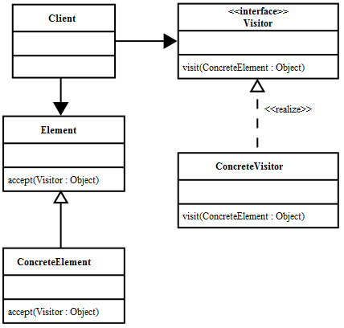

# Visitor pattern

---

### Цел
Шаблонът „Посетител” позволява добавяне на функционалност към структура от различни обекти, без да се налага модифициране на дефинициите на самите обекти.

---

### Приложения

Шаблонът може да се използва в следния случаи:

* Дадена обектна структура съдържа множество типове от обекти с различаващи се интерфейси, а се налага да се изпълнят операции върху тези обекти, които зависят от конкретния клас;

* множество различни и несвързани операции са нужни да бъдат изпълнени върху обекти от обектната структура, но е нужно да се избегне добавяне на техните класове с тези операции;

* класовете в обектната структура се променят рядко или не могат да бъдат променяни, но е необходимо да се добавят нови операции към тях;

* в частен случай на горните приложения, шаблонът може да се използва дори когато структурата от обекти съдържа само един тип обект, който обаче не можем да променяме, и затова дефинираме операциите извън него.

---

### Оценка

Следват няколко забележки за плюсовете, минусите и страничните ефекти при използване на шаблона:

1.	Можем лесно да добавяме нови операции – за всяка нова операция е нужен нов конкретен посетител, без да променяме елемените (класовете, участници в структурата). Ако имаме много различни конкретни елементи, добавяне на една и съща операция във всеки един от тях би довело до повтаряне на код. Шаблонът „Посетител“ е лесен начин за прилагане на т.нар open/closed principle, който гласи, че един клас трябва да е отворен за добавяне на функционалност, но затворен за модифициране.

2.	Ако е необходимо да приложим няколко сходни операции върху елементите на структурата, то можем да използваме йерархии от посетители, които да споделят общата функционалност. Посетителите са обикновени класове и могат да се възползват от наследяване и композиция за да извършат задачите си.

3.	При използване на шаблона добавянето на нови класове от тип „конкретен елемент“ е трудно – необходимо е във всеки конкретен посетител да бъде добавен метод visit(..) приемащ новия тип. Т.е. едно от нещата, които трябва да преценим, преди да използваме шаблона е дали ще се налага да добавяме нови типове конкретни елементи към структурата по-често отколкото се налага да добавяме нови операции към съществуващите.

4.	Обхождането на елементите от дадена структура може да стане и с шаблона Итератор. За целта обаче всички елементи трябва да са от един тип. При шаблона „Посетител“ това не е необходимо – нужно е само да имплементират Element-интерфейса, а посетителят се грижи за извършване на операциите върху различни обекти, които не са част от една йерархия. 

5.	Използването на шаблона „Посетител“ позволява акумулиране на данни при последователни „посещения“ на различните елементи на структурата. По тозни начин операцията върху всеки следващ елемент може да зависи от резултата при изпълнение върху предишния. Ако не използваме посетител, то тези данни биха се предавали чрез допълнителни аргументи на методите на различните класове.

6.	За да може посетителят да изпълни операции върху даден обект, то обектът трябва да предостави поне частично своите данни. Т.е. член променливите да са достъпни за четене и запис (или директно, или чрез setter/getter методи). По този начин се нарушава капсулацията, което понякога се счита за минус на шаблона.

7.	Шаблонът „Посетител“ симулира т.нар. double-dispatch (двойно извикване). Този механизъм се използва, когато изпълненията код зависи от типа на даден обект по време на изпълнение на програмата. В езици, които не поддържат механизма, шаблонът „Посетител“ позволява избягването на „ръчната“ проверка дали обектът е от даден тип – if (x instanceof Y)
