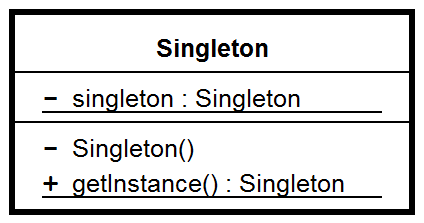

# Singleton pattern

---

### Цел

Целта на сингълтон шаблона е да гарантира създаването на една единствена инстанция на класа и да предостави глобална точка на достъп до него.

---

### Приложения

Сингълтонът се използва в следните случаи:

* Трябва да съществува една единствена инстанция от даден клас, която може да се достъпва от известно място за достъп.

* единствената инстанция трябва да бъде отворена за разширение чрез наследяване и потребителите трябва да са способни да използват въпросната инстанция без модификация на кода 

Съществуват много ситуации, в които се нуждаем от един обект за нещо, предлагащ общи данни или услуга: пул от нишки, инстанция на клас управляващ някакъв кеш, клас управляващ появяването на диалогови прозорци, обекти  използвани за водене на логове, обекти съхраняващи настройки, предпочитания или настройки в регистрите, обекти функциониращи като драйвери за принтери, графични карти или бази данни. В тези случаи трябва да бъде забранена възможността за създаване на повече от една инстанция на съответния обект.

---

### Оценка

Сингълтонът притежава следните особености:

1.	Контролиране на достъпа до единствената инстанция. Понеже сингълтонът енкапсулира неговата единствена инстанция, той може да определя времето и начина на достъп до него.

2.	Ограничаване на претрупването с имена. Представлява подобрение над глобалните променливи. Предпазва от претрупване на пространството от имена с глобални променливи, които съхраняват уникални инстанции.

3.	Позволява по-прецизното дефиниране на операции и инстанции на класове.

4.	Позволява променлив брой инстанции. Шаблонът позволява създаваненето на повече от една инстанция на сингълтона, като контролирането на създаването и броя инстанции се извършва в метода предоставящ  достъп до инстанцията на сингълтона.