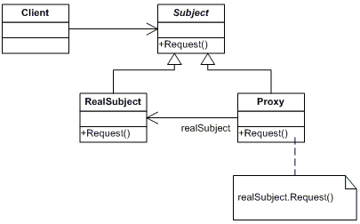

# Proxy pattern

---

### Цел

Целта на шаблона „Прокси” (Proxy) е да предостави заместник или контейнер за даден реален обект, позволявайки контролиран достъп до него.

---

### Приложения

Контролирането на достъпа до даден обект може да се налага при различни ситуации:

* достъпване на обект, който се намира в друг процес, протичащ на отдалечена машина – отдалечено прокси (remote proxy);

* контролиране на момента на инстанциране и инициализация на обект, заемащ много памет – виртуално прокси (virtual proxy);

* проверка на права за достъп до обект – защитно прокси (protection proxy);

* изпълнение на сложнa логика при достъпването на обект, като например броене на референции и отказ на достъп при достигане на определен брой, зареждане на обект от база данни в паметта при поискване (lazy loading) и т.н – умна референция (smart reference);

* контролиране на конкурентен достъп до несинхронизирани обекти – синхронизиращо прокси (synchronization proxy).

---

### Оценка

При реализация на шаблона „Прокси” (Proxy) е добре да знаем следните неща:

1.	Шаблонът „Прокси” (Proxy) добавя ново ниво на непряк достъп до реалните обекти. Всяко такова ниво прави работата на системата ни по – сложна. Различните типове реализации на шаблона добавят и различно ниво на непряк достъп:

	* отдалеченото прокси (remote proxy) като ниво на непряк достъп скрива истинското местоположение на реалния обект;

	* виртуалното прокси (virtual proxy) като ниво на непряк достъп скрива момента на създаване на скъп по отношение на памет обект;
	
	* защитното прокси (protection proxy) като ниво на непряк достъп скрива механизма за контрол на достъпа до чувствителен обект. 

2.	В случай, че имаме множество прокси инстанции, които държат референция към един скъпо струващ реален обект, можем да използваме оптимизацията "копиране при промяна" (copy-on-write). Тази оптимизация се състои в това, че копиране на реалния обект се извършва само тогава, когато клиентът, обръщаш се към прокси инстанцията иска да направи промяна в състоянието на реалния обект. По този начин ограничаваме броя скъпо струващи инстанции и елиминираме възможността за дублиране на едно и също състояние на реалния обект.
